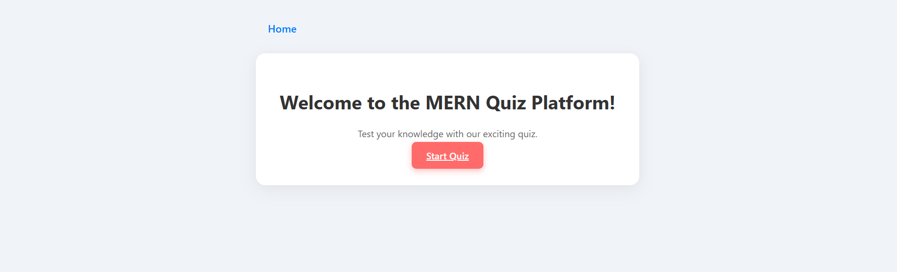
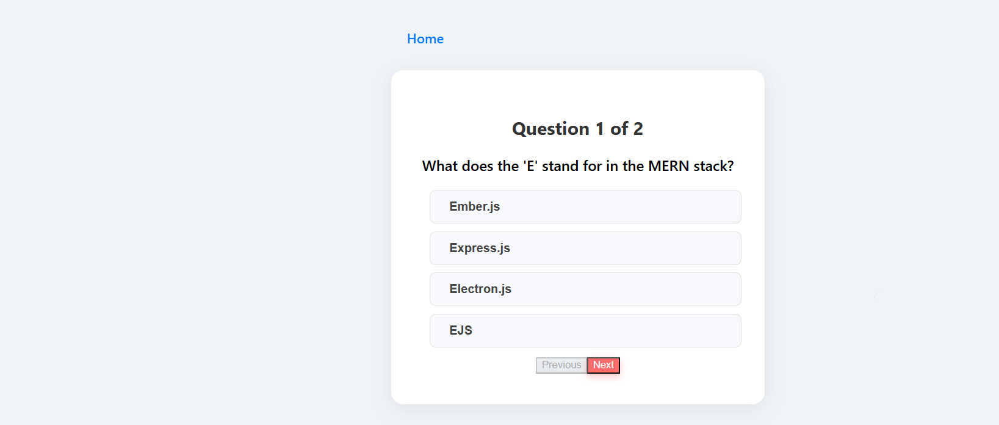
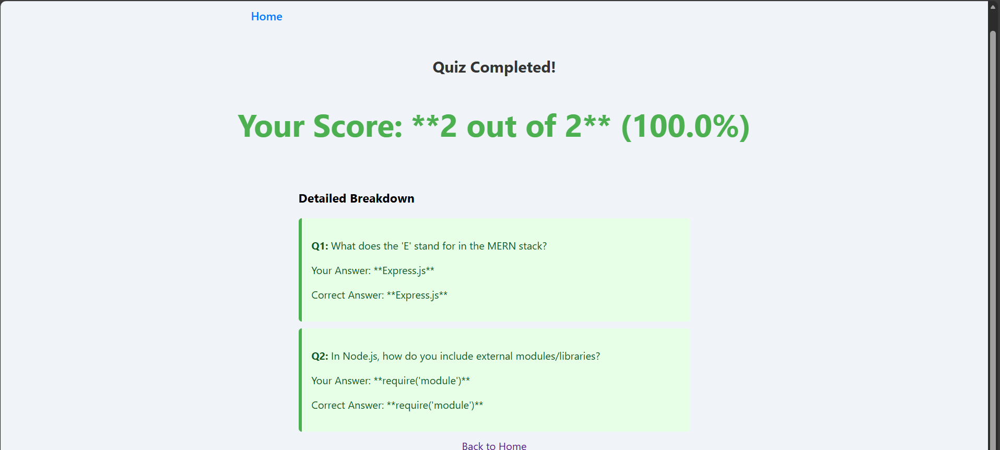

# Quiz Platform

A web-based quiz platform built with [your tech stack, e.g., MERN stack].

## Project Structure
- `client/` → Frontend code
- `server/` → Backend code
- `screenshots/` → Project screenshots

## Features
- Take quizzes online
- Track scores
- Admin can add questions

## How to Run

### Backend
1. Go to `server/` folder
2. Install dependencies: `npm install`
3. Start the server: `npm start`

### Frontend
1. Go to `client/` folder
2. Install dependencies: `npm install`
3. Start the app: `npm start`

## Screenshots
### Home Page

### Quiz Page

### LoginPage

### ResultPage
